# Enterprise Helpdesk and Active Directory Lab

A home lab environment simulating a small German company's IT infrastructure. I built this to get hands-on experience with Active Directory, Group Policy, and the kind of support tasks that come up every day in L1-L3 helpdesk work.

*Note on Infrastructure:* Originally designed for VirtualBox, this lab was migrated to **Microsoft Azure** to bypass local hardware RAM limitations (16GB) and ensure high performance for Windows 11 and Server 2025.

## ☁️ Why I built this
I have been helping family and friends with IT issues for years - password
resets, Wi-Fi troubleshooting, printer problems, setting up new laptops and system optimization for better speed and battery life etc. I also helped my German landlord set up their router, new mobile phone setup and fix mobile issues on multiple occasions. But none of that shows up on a CV.

So I decided to build the same kind of 'simulated' environment that a real company would have, document everything properly and show that I can help company and it's people with support work and administration related tasks systematically and not just 'I fixed my friend's laptop.'

## ☁️ What is in here

This lab simulates "CORP GmbH", which is a fictional German company with about 50 employees across five departments. The infrastructure includes:

- A Windows Server 2025 domain controller (named as - DC01) running AD DS, DNS and DHCP
- A Windows 11 workstation (named as - CLIENT01) joined to the domain
- An Ubuntu 22.04 server (named as - LINUX01) joined to AD via realmd/SSSD

## ☁️ Why is this lab Important?

Because I will be -

- Building multiple virtual machines
- Installing Windows and Linux
- Practising my Networking skills and permissions
- Creating an Active Directory environment
- Running snapshots and backups
- Experimenting freely
- Breaking things without breaking my real PC

Not to mention, I will also be able to test the lab by -

- Adding and managing users
- Resettings passwords
- Joining users or computers to a domain
- Troubleshooting network and DNS issues
- Simulating real help desk tickets

In short, I will have a mini DNS center in my PC!

## ☁️ How to set up this lab from scratch
*Update:* The infrastructure is now built inside an Azure Virtual Network (VNet) named CorpNet, consisting of:

### VMs

- DC01 (Windows Server 2025): The "Brain" of the company. Domain Controller, DNS, and DHCP.
- CLIENT01 (Windows 11): An employee workstation joined to the corp.gmbh domain.
- LINUX01 (Ubuntu 22.04): A Linux server integrated into the AD environment using realmd/SSSD.

## ☁️ Current Option: Cloud Deployment (Microsoft Azure)
To ensure the lab runs smoothly without slowing down my physical laptop, I used the following Azure resources:

- Virtual Network: 10.0.0.0/16 (Internal subnet for secure VM communication).

### VM Sizing:
- DC01: Standard_B2als_v2 - 2vcpus, 4GiB memory - Windows Server *2025* Datacenter: Azure Edition - x64 Gen2
- CLIENT01: Standard_DC1ds_v3 (1 vcpu, 8 GiB memory) - Windows 11 25H2 pro
- LINUX01: Standard_D2ads_v7 (2 vcpus, 8 GiB memory) - Ubuntu server 24.04 LTS

### Cost Management: 

Configured Auto-shutdown schedules to preserve Azure credits.

---

## ☁️ Module 1: Infrastructure Setup

### 🟦 Step 1: Virtual Network

Created `VNet-CorpNet` in resource group `RG-CorpGmbH`, Germany West Central. Address space `10.0.0.0/16` with one subnet `InternalSubnet` at `10.0.0.0/24`. All three VMs live on this subnet and communicate over private IPs only. Public internet access is restricted to RDP and SSH through Network Security Groups.


### 🟦 Step 2: DC01 - Domain Controller

Deployed DC01 as the first VM. This is the brain of the lab. Everything else depends on it.

| Setting | Value |
|---|---|
| Name | DC01 |
| OS | Windows Server 2025 Datacenter Azure Edition |
| Size | Standard_B2als_v2 (2 vCPU, 4 GiB RAM) |
| Private IP | 10.0.0.4 (static) |
| VNet | VNet-CorpNet / InternalSubnet |
| NSG | DC01-nsg |
| Location | Germany West Central |


### 🟦 Step 3: CLIENT01 - Windows 11 Workstation

CLIENT01 simulates an employee's computer. It will join the corp.gmbh domain once DC01 is configured.

| Setting | Value |
|---|---|
| Name | CLIENT01 |
| OS | Windows 11 Pro 23H2 |
| Size | Standard_DC1ds_v3 (1 vCPU, 8 GiB RAM) |
| Private IP | 10.0.0.5 (static) |
| VNet | VNet-CorpNet / InternalSubnet |
| NSG | CLIENT01-nsg |
| Location | Germany West Central |


### 🟦 Step 4: LINUX01 - Ubuntu Server

LINUX01 is the Linux side of the lab. It will be integrated into Active Directory using realmd and SSSD.

| Setting | Value |
|---|---|
| Name | LINUX01 |
| OS | Ubuntu 24.04 LTS |
| Size | Standard_D2ads_v7 (2 vCPU, 8 GiB RAM) |
| Private IP | 10.0.0.6 (static) |
| VNet | VNet-CorpNet / InternalSubnet |
| NSG | LINUX01-nsg |
| Location | Germany West Central |

> *Note:* Standard_B1s was not available in Germany West Central. Used Standard_D2ads_v7 instead. See Issue #11.


### 🟦 Step 5: All three VMs running


### 🟦 Step 6: RDP into DC01 and verify connectivity

RDP'd into DC01 using the downloaded RDP file. Server Manager opened confirming Windows Server 2025 is running.


Then ran connectivity test from DC01 PowerShell to confirm all three VMs can reach each other over the internal subnet:

```powershell
Test-NetConnection -ComputerName 10.0.0.5 -Port 3389
Test-NetConnection -ComputerName 10.0.0.6 -Port 22
```

Azure blocks ICMP ping by default so TCP port test was used instead.


Both returned `TcpTestSucceeded: True`. All three VMs are on the same subnet and talking to each other. Module 1 complete.

### 🟦 Step 7: Deallocate after session

After taking all screenshots, all three VMs were deallocated to stop compute charges. Public IPs were deleted. New public IPs will be assigned at the start of each session. Issue #4 and Issue #11 were resolved successfully.


---

## ☁️ Module 2: Active Directory, DNS and DHCP

### 🟦 Step 1: Install AD DS role

Still in the same PowerShell session where connectivity was tested, installed the Active Directory Domain Services role:

```powershell
Install-WindowsFeature AD-Domain-Services -IncludeManagementTools
```

The screenshot below shows the full context. At the top you can see the connectivity test results from the previous step (TcpTestSucceeded True for both VMs), then immediately below it the AD DS installation running and completing with `Success: True`, `Exit Code: Success`, and `Feature Result: Active Directory Domain Services, Group P...`.

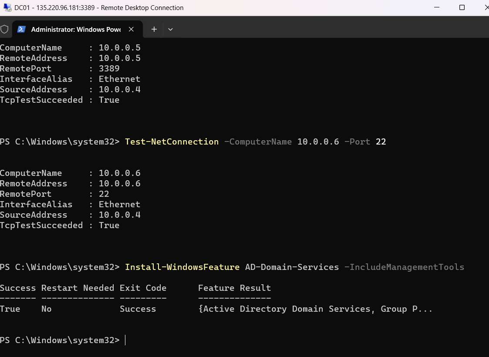

### 🟦 Step 2: Promote DC01 to domain controller

After AD DS installed, promoted DC01 to a domain controller and created the new forest `corp.gmbh`. See Issue #8.

```powershell
Install-ADDSForest -DomainName "corp.gmbh" -InstallDns -Force
```

> Note: The first two attempts failed because copy-pasted parameters used Unicode em-dashes instead of ASCII hyphens, so PowerShell did not recognise them. Removed the extra parameters and Windows set the NetBIOS name CORP automatically. See Issue #5.

The screenshot below shows the promotion in progress. DC01 is running `Install-ADDSForest`, validating the environment, running all prerequisite tests successfully, then starting to install the new forest and configure the DNS Server service. The server restarted automatically after this completed.

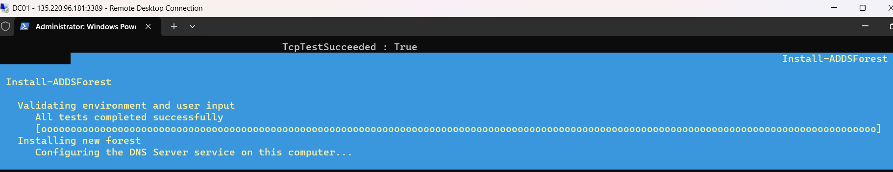

### 🟦 Step 3: Confirm domain created

After the restart, RDP'd back into DC01 and ran:

```powershell
Get-ADDomain
Get-ADForest
```

`Get-ADDomain` confirmed: `DNSRoot: corp.gmbh`, `NetBIOSName: CORP`, `PDCEmulator: DC01.corp.gmbh`, `DomainMode: Windows2025Domain`. DC01 is running all five FSMO roles as the only domain controller.

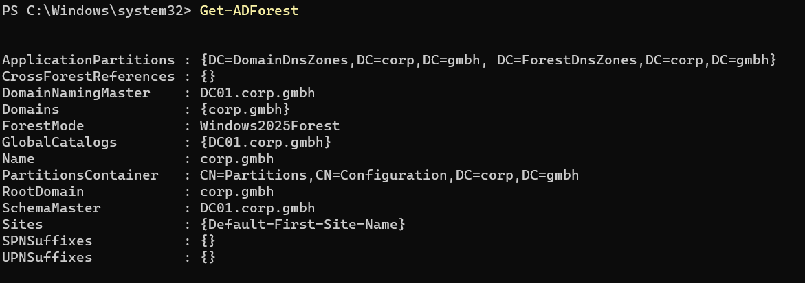

`Get-ADForest` confirmed: `ForestMode: Windows2025Forest`, `RootDomain: corp.gmbh`, `GlobalCatalogs: DC01.corp.gmbh`. The forest is running at Windows Server 2025 functional level.

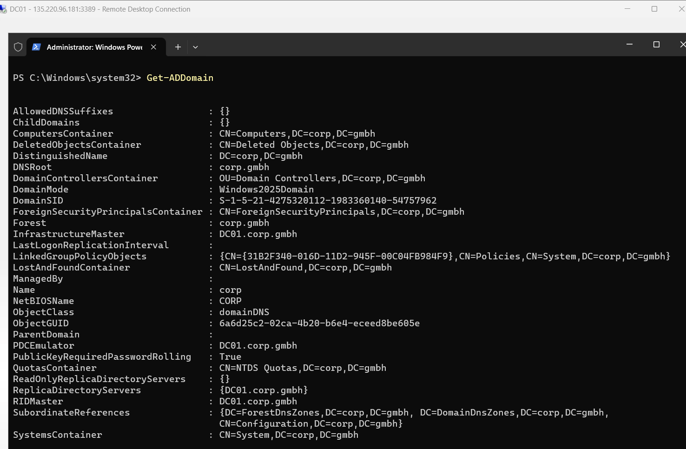

Then opened Active Directory Users and Computers to confirm the domain was visible which closes Issues #5:

```powershell
dsa.msc
```

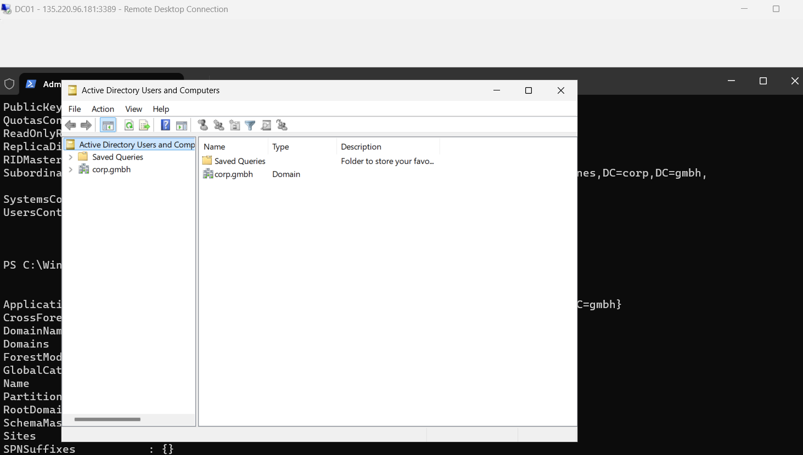


### 🟦 Step 4: Configure DNS

Created `C:\CorpLab\Setup-DNS.ps1` on DC01 using Notepad and ran it:

```powershell
notepad C:\CorpLab\Setup-DNS.ps1
cd C:\CorpLab
.\Setup-DNS.ps1
```

The script added a reverse lookup zone for `10.0.0.0/24`, an A record for `linux01` at `10.0.0.6`, an A record for `srv01` at `10.0.0.20` reserved for a future file server, CNAME aliases for `helpdesk` and `monitoring` both pointing to `srv01.corp.gmbh`, and set external forwarders to `8.8.8.8` and `1.1.1.1`.

The output showed `DNS configured successfully` in green, followed by a full table of all records in the corp.gmbh zone including the A records, CNAME aliases, and all the Kerberos and LDAP SRV records that Active Directory created automatically.

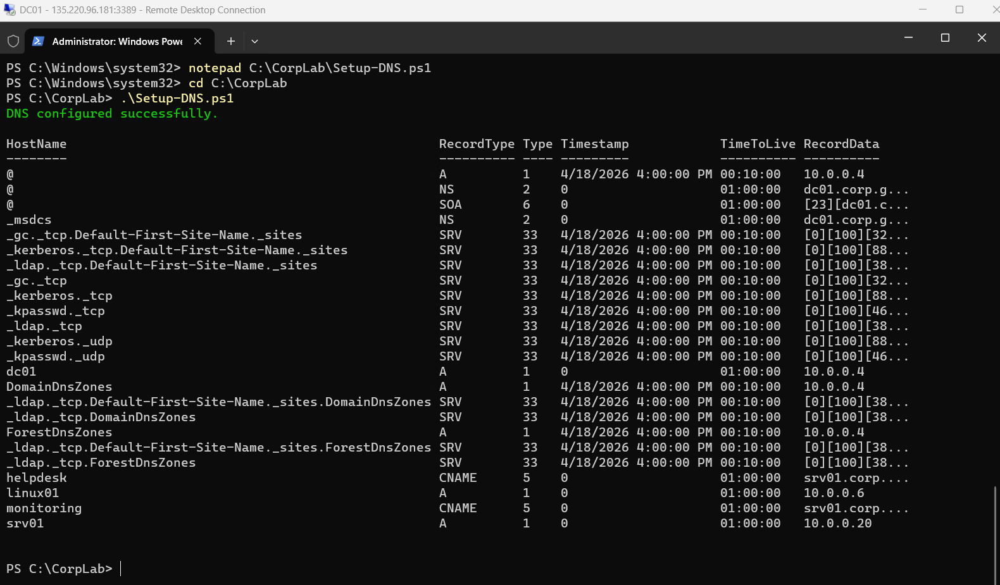

Then opened DNS Manager to verify visually:

```powershell
dnsmgmt.msc
```

The DNS Manager showed the corp.gmbh forward lookup zone with all records: dc01 Host A at 10.0.0.4, linux01 Host A at 10.0.0.6, helpdesk Alias CNAME pointing to srv01.corp.gmbh, monitoring Alias CNAME pointing to srv01.corp.gmbh, and srv01 Host A at 10.0.0.20. Reverse Lookup Zones also created for the 10.0.0.0/24 subnet.

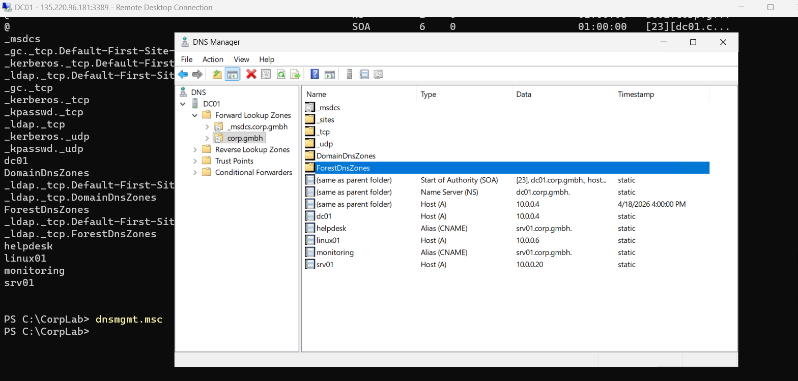

Right-clicked DC01 in DNS Manager, Properties, Forwarders tab. Both forwarders showing: 8.8.8.8 resolving to dns.google and 1.1.1.1 resolving to one.one.one.one.

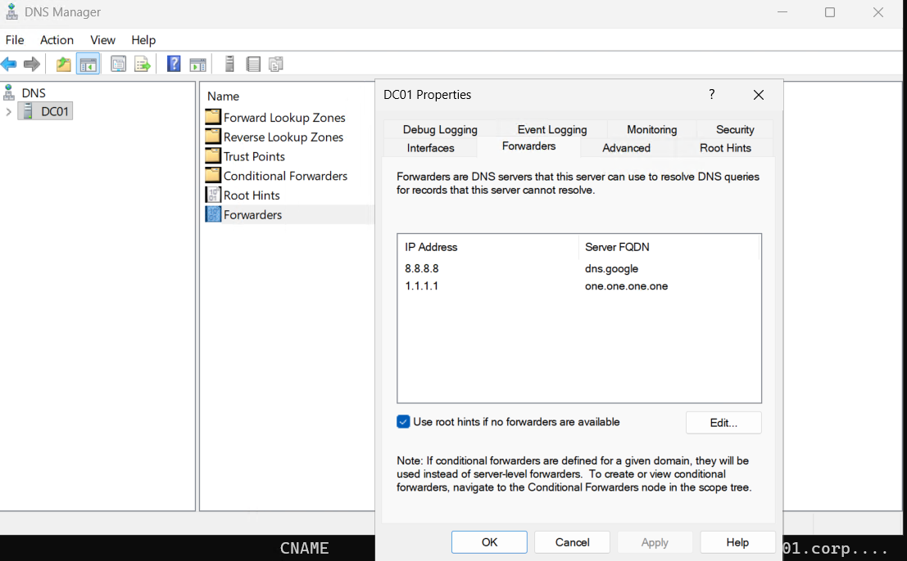

### 🟦 Step 5: Configure DHCP

Created `C:\CorpLab\Setup-DHCP.ps1` and ran it:

```powershell
.\Setup-DHCP.ps1
```

The script installed the DHCP Server role, authorized it in Active Directory, created scope `CorpNet-LAN` for range `10.0.0.100` to `10.0.0.200` with an 8 hour lease, excluded `10.0.0.1` to `10.0.0.50` for static server IPs, set DNS server option to `10.0.0.4` and domain name to `corp.gmbh`, and added a reservation for LINUX01 at `10.0.0.6`.

There was a warning about no static IP addresses found on the computer. This is a known Azure behaviour and does not affect DHCP functionality. The scope still created and activated correctly.

Output showed `DHCP configured successfully` in green, followed by the scope table: ScopeId `10.0.0.0`, SubnetMask `255.255.255.0`, Name `CorpNet-LAN`, State `Active`, StartRange `10.0.0.100`, EndRange `10.0.0.200`, LeaseDuration `08:00:00`.

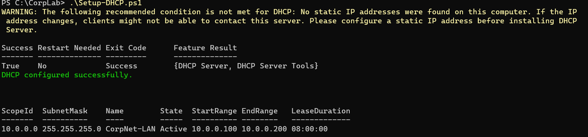

Then opened DHCP Manager to verify:

```powershell
dhcpmgmt.msc
```

DHCP Manager showed the full scope tree under `dc01.corp.gmbh`: IPv4, Scope [10.0.0.0] CorpNet-LAN, with Address Pool, Address Leases, Reservations containing `[10.0.0.6] LINUX01`, Scope Options, and Policies. The Scope Options panel on the right confirmed option 006 DNS Servers set to `10.0.0.4` and option 015 DNS Domain Name set to `corp.gmbh`.

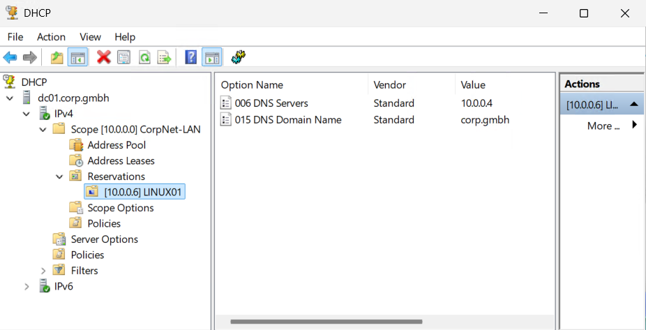

### 🟦 Step 6: Build the full AD structure

Created `C:\CorpLab\Setup-ADStructure.ps1` and ran it:

```powershell
.\Setup-ADStructure.ps1
```

The script ran for about 3 to 4 minutes. While it ran, the output streamed each creation in real time.

The script built:
- **18 Organizational Units** with German department names: CORP, Benutzer, IT, Vertrieb, Buchhaltung, Personal, Geschaeftsleitung, Entwicklung, Marketing, Extern, Computer, Workstations, Laptops, Server, Gruppen, ServiceAccounts, Konferenzraeume, Deaktiviert
- **32 security groups**: department groups (GRP-Dept-*), file share groups (GRP-FileShare-*), IT support tiers GRP-IT-L1-Support / GRP-IT-L2-Admin / GRP-IT-L3-Infrastructure, application groups (GRP-App-ERP, GRP-App-CRM, GRP-App-GitLab, GRP-App-Jira, GRP-App-Office365), printer groups, and project groups
- **52 user accounts** across 8 departments with realistic German names, correct group memberships, home directory paths, and forced password change at first logon

When complete, the terminal showed the summary: `AD STRUCTURE SETUP COMPLETE`, Organizational Units: 18, Security Groups: 32, User Accounts: 52, and the log file path `C:\Setup\Logs\AD-Setup-2026-04-18-1727.log`.

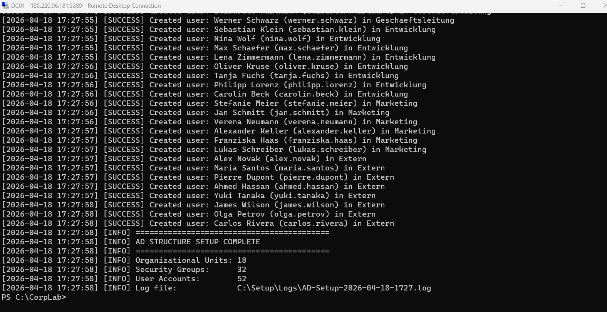

### 🟦 Step 7: Verify AD structure in ADUC

Opened ADUC to check the structure visually. The left tree showed the full OU hierarchy exactly as designed: CORP at the top, then Benutzer with all department sub-OUs (Buchhaltung, Entwicklung, Extern, Geschaeftsleitung, IT, Marketing, Personal, Vertrieb), then Computer with Workstations/Laptops/Server, then Deaktiviert, Gruppen, Konferenzraeume, and ServiceAccounts.

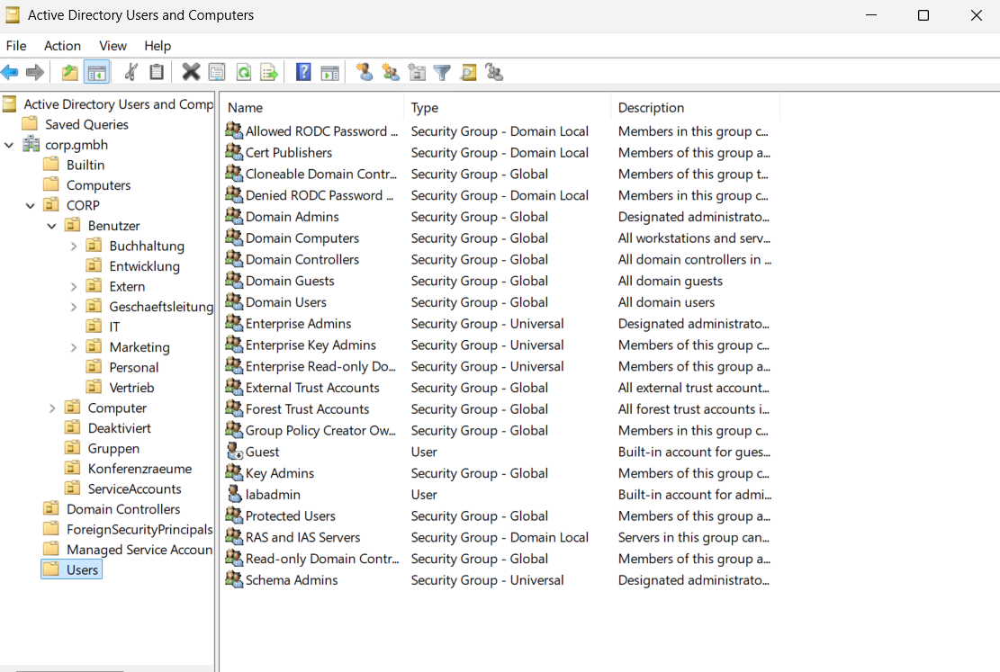

Clicked the IT OU to verify users were created correctly in the right department. Showed 7 users: Daniel Bauer, Florian Koenig, Kevin Wagner, Lisa Schmidt, Petra Schulz, Sabine Lehmann, Thomas Mueller. All matching the script's IT department definition.

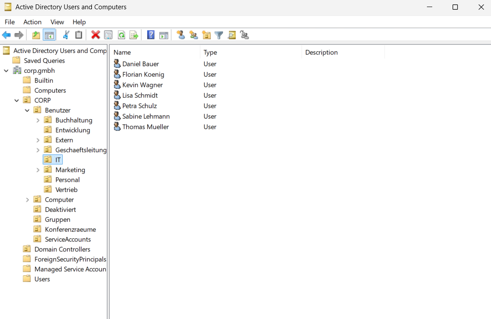

Clicked Vertrieb OU. Showed 10 users: Anna Becker, Christian Roth, Julia Weber, Katharina Frank, Markus Lange, Melanie Seidel, Nadine Schubert, Patrick Huber, Stefan Hoffmann, Tobias Berger.

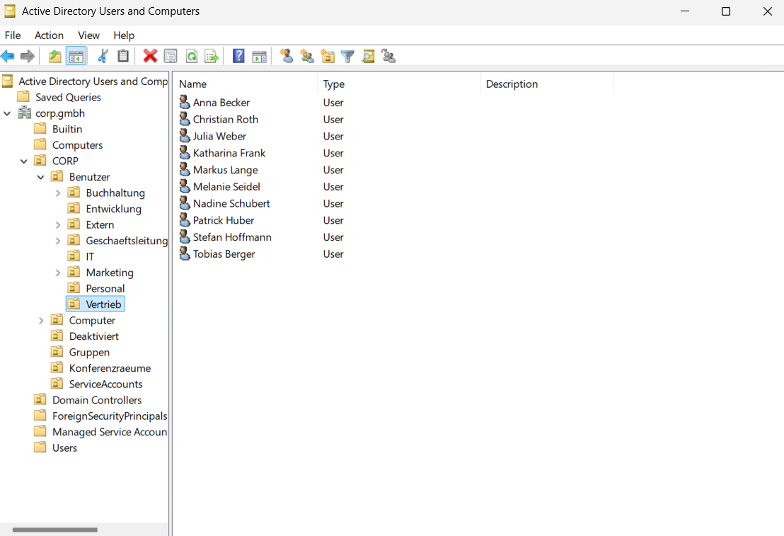

Clicked Gruppen OU to check the security groups. Showed all groups created with their German descriptions: GRP-App-CRM with "CRM-System Zugriff", GRP-App-ERP, GRP-App-GitLab, GRP-App-Jira, GRP-App-Office365, all department groups, all file share groups, and the IT tier groups GRP-IT-L1-Support with "L1 Helpdesk: password re...", GRP-IT-L2-Admin with "L2 Admin: GPO, DHCP, D...", GRP-PrinterBW and GRP-PrinterColor all visible.

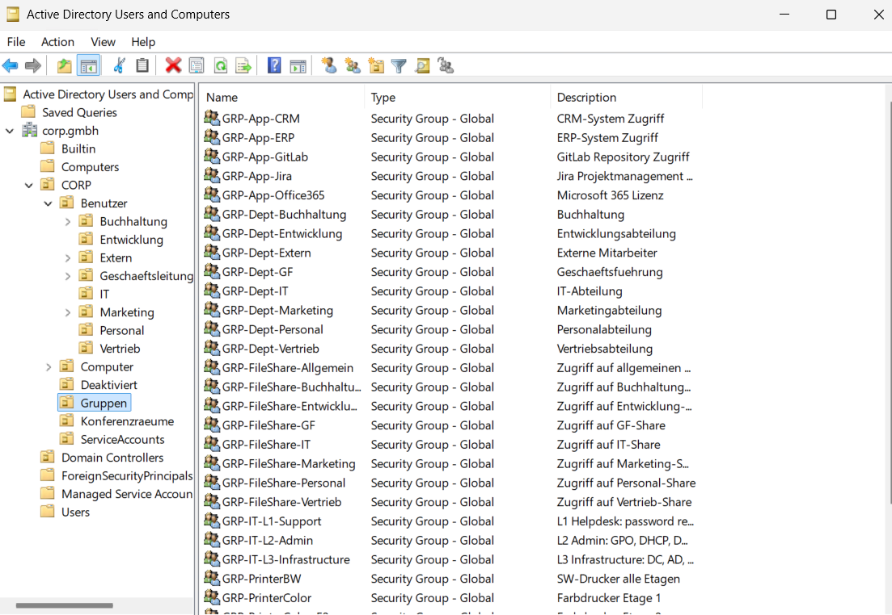

### 🟦 Step 8: Check the log file

Opened the log file that the script wrote to `C:\Setup\Logs\AD-Setup-2026-04-18-1727.log` in Notepad to verify everything completed without errors.

The log showed every action timestamped. Starting from 17:27:48, it logged `Starting AD structure setup for CORP GmbH`, then every OU creation with `[SUCCESS]` prefix: CORP, Benutzer, IT, Vertrieb, Buchhaltung, Personal, Geschaeftsleitung, Entwicklung, Marketing, Extern, Computer, Workstations, Laptops, Server, Gruppen, ServiceAccounts, Konferenzraeume, Deaktiviert. Then all 32 groups: GRP-Dept-IT, GRP-Dept-Vertrieb, GRP-Dept-Buchhaltung, GRP-Dept-Personal, GRP-Dept-GF, GRP-Dept-Entwicklung, GRP-Dept-Marketing, GRP-Dept-Extern, GRP-FileShare-Allgemein, GRP-FileShare-IT, GRP-FileShare-Vertrieb, GRP-FileShare-Buchhaltung, GRP-FileShare-Personal, and continuing through all groups.

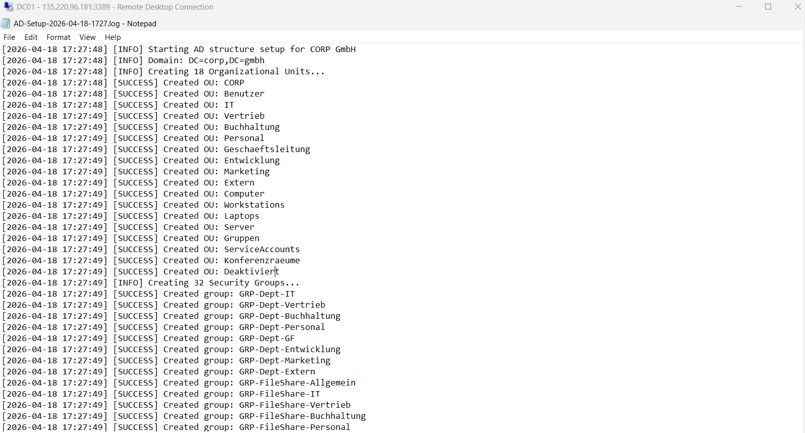

Scrolled down in the log to see the user creation section and the final summary. The log showed all users being created with `[SUCCESS]` entries including the Entwicklung department users (Werner Schwarz, Sebastian Klein, Nina Wolf, Max Schaefer, Lena Zimmermann, Oliver Kruse, Tanja Fuchs, Philipp Lorenz, Carolin Beck), then Marketing users (Stefanie Meier, Jan Schmitt, Verena Neumann, Alexander Keller, Franziska Haas, Lukas Schreiber), then Extern users (Alex Novak, Maria Santos, Pierre Dupont, Ahmed Hassan, Yuki Tanaka, James Wilson, Olga Petrov, Carlos Rivera). Final log entries confirmed the summary: Organizational Units: 18, Security Groups: 32, User Accounts: 52.

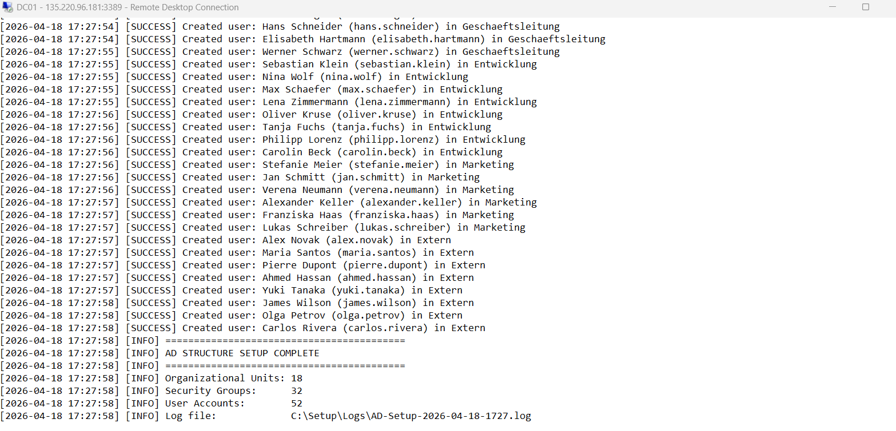

### 🟦 Step 9: Fine-grained password policy

The Setup-ADStructure.ps1 script attempted to create PSO-IT-Admins automatically but it failed silently. Created it manually after noticing the Verify-LabSetup.ps1 health check was failing on that item:

```powershell
New-ADFineGrainedPasswordPolicy -Name "PSO-IT-Admins" `
    -Precedence 10 `
    -MinPasswordLength 16 `
    -PasswordHistoryCount 30 `
    -ComplexityEnabled $true `
    -MaxPasswordAge "60.00:00:00" `
    -LockoutThreshold 3 `
    -LockoutDuration "00:30:00" `
    -LockoutObservationWindow "00:30:00"

Add-ADFineGrainedPasswordPolicySubject -Identity "PSO-IT-Admins" `
    -Subjects "GRP-IT-L2-Admin","GRP-IT-L3-Infrastructure"

Write-Host "PSO-IT-Admins created successfully" -ForegroundColor Green
```

This creates a stricter password policy specifically for IT administrators: 16 character minimum, 3 lockout attempts maximum, 30 minute lockout duration. Applied to GRP-IT-L2-Admin and GRP-IT-L3-Infrastructure. Regular users keep the Default Domain Policy with 12 characters. Separating privileged account policies from standard users follows BSI IT-Grundschutz recommendations.

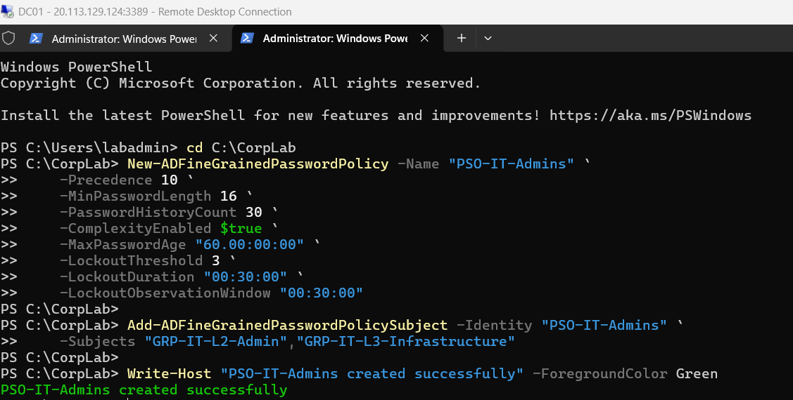

Now, no more errors anywhere. Module 2 was completed successfully. And the Issue #5 and Issue #8 were resolved completely.

---

## ☁️ Module 3: Joining CLIENT01 to the Domain

### 🟦 Step 1: Set DNS and verify resolution

RDP'd into CLIENT01 using its public IP `9.141.72.22`. Opened PowerShell as Administrator and pointed DNS to DC01:

```powershell
Set-DnsClientServerAddress -InterfaceAlias "Ethernet" -ServerAddresses 10.0.0.4
nslookup corp.gmbh
```

`nslookup` returned `Server: UnKnown`, `Address: 10.0.0.4`, then `Name: corp.gmbh`, `Address: 10.0.0.4`. The UnKnown next to Server just means reverse DNS is not configured for 10.0.0.4 yet, which is fine. The important result is that `corp.gmbh` resolved correctly to `10.0.0.4` confirming CLIENT01 is now querying DC01 for DNS.

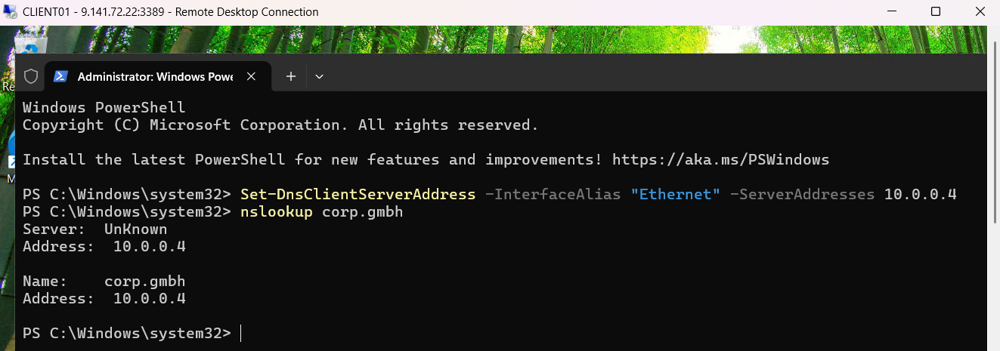

### 🟦 Step 2: Join CLIENT01 to corp.gmbh

Joined the domain via the Windows GUI. Right click Start > System > Advanced system settings > Computer Name tab > Change > selected Domain > typed `corp.gmbh`.

> Note: Domain join failed multiple times when using `corpAdmin`. That is a local Azure VM account and does not exist in the domain at all. The correct account is `CORP\labadmin` which was automatically added to Domain Admins when DC01 was promoted. See Issue #6 and #9.

CLIENT01 restarted automatically after the join succeeded.

### 🟦 Step 3: Confirm domain membership via systeminfo

After restart, RDP'd back into CLIENT01. Ran in PowerShell:

```powershell
systeminfo | findstr /i "domain"
```

Output showed `Domain: corp.gmbh` confirming CLIENT01 is a member of the corp.gmbh domain.

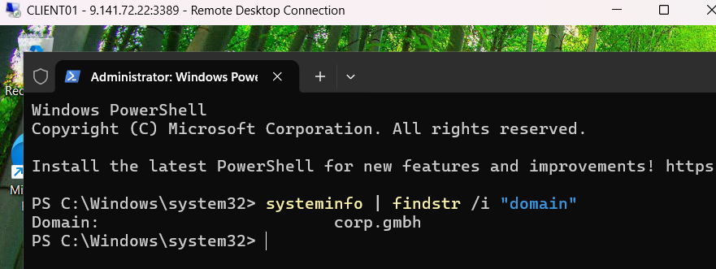

Then opened System Properties to confirm visually:

```powershell
sysdm.cpl
```

System Properties showed `Full computer name: CLIENT01.corp.gmbh` and `Domain: corp.gmbh`.

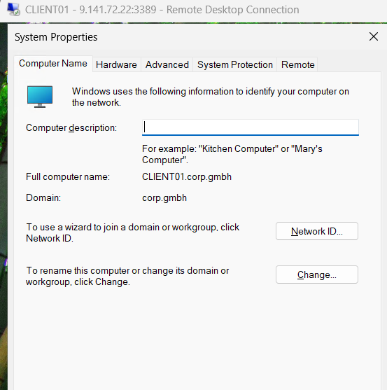

### 🟦 Step 4: Move CLIENT01 to the correct OU

Back on DC01, opened ADUC. Found CLIENT01 in the default Computers container. Right click > Move > selected `OU=Workstations, OU=Computer, OU=CORP`.

GPOs are linked to `OU=Workstations`. Until CLIENT01 was moved here, no domain Group Policy would apply to it. The default Computers container is not an OU and GPOs cannot be linked to it.

ADUC showed CLIENT01 now sitting inside Workstations under Computer under CORP.

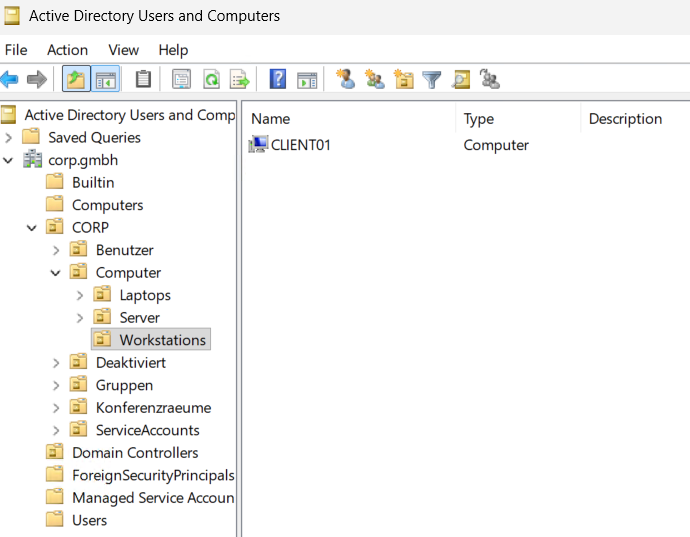

### 🟦 Step 5: Force Group Policy and verify

Back on CLIENT01, ran:

```powershell
gpupdate /force
gpresult /r
```

`gpupdate /force` returned `Computer Policy update has completed successfully` and `User Policy update has completed successfully`.

`gpresult /r` showed the full Group Policy result. Key details: `OS Configuration: Member Workstation`, `Group Policy was applied from: DC01.corp.gmbh`, `Domain Name: CORP`, and under Applied Group Policy Objects it listed `Default Domain Policy`. This confirms CLIENT01 is receiving policy from the domain controller correctly.

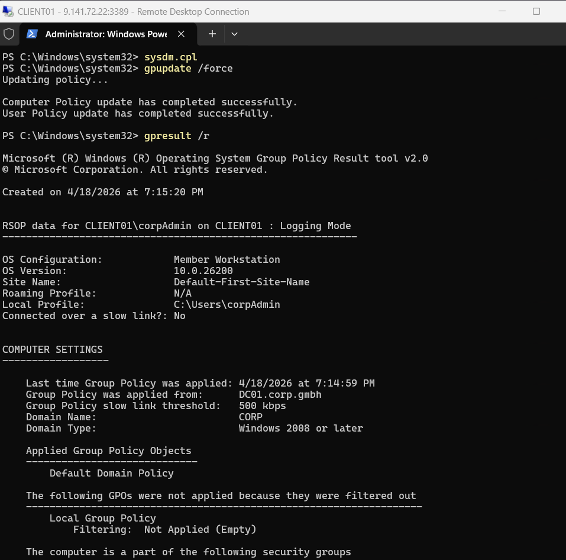

### 🟦 Step 6: Run Join-Domain.ps1 script

Tested the automated domain join script to show how a fresh machine would be joined without using the GUI. Copied `Join-Domain.ps1` to `C:\` on CLIENT01 and ran it:

```powershell
.\Join-Domain.ps1
```

The script ran through all three steps: set DNS to DC01 at 10.0.0.4, tested DNS resolution confirming `corp.gmbh resolves to 10.0.0.4` in green, then initiated the domain join prompting for admin credentials. Since CLIENT01 was already joined, this demonstrates the script logic working correctly end to end: DNS configuration, verification and domain join initiation all automated.

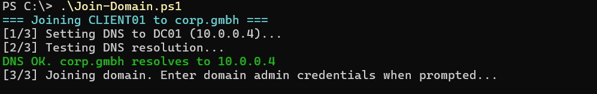

### 🟦 Step 7: Run New-NetworkPrinter.ps1 script

Tested the network printer installation script against the srv01 reserved IP:

```powershell
.\New-NetworkPrinter.ps1 -PrinterIP "10.0.0.20" -PrinterName "Drucker-Etage1-Farbe"
```

The script tested connectivity to `10.0.0.20` on port 9100. The connection failed because srv01 does not exist in this lab yet. The script correctly identified this, reported the error with a clear actionable message and exited cleanly without installing a broken printer. This is the right behaviour for a production script: test connectivity first, fail fast with a useful message rather than hanging. In a real environment this would point to an actual network printer and proceed through all four steps: port test, port creation, printer installation and test page prompt.

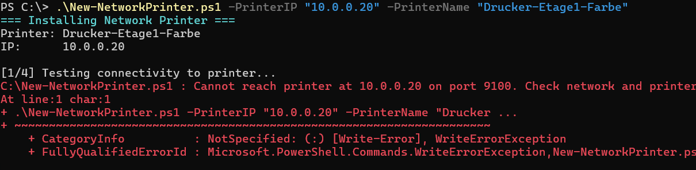

Therefore, module 3 was completed successfully. In this way, CLIENT01 is domain-joined, in the correct OU and receiving Group Policy from DC01.

---

## ☁️ Module 4: Linux Integration on LINUX01

### 🟦 Step 1: SSH into LINUX01

SSH'd into LINUX01 from the laptop terminal using its public IP:

```bash
ssh linuxadmin@20.79.170.94
```

The Ubuntu welcome screen confirmed: system load 0.0, memory usage 3%, IPv4 address for eth0 at `10.0.0.6`, 0 updates pending. System was clean and ready.

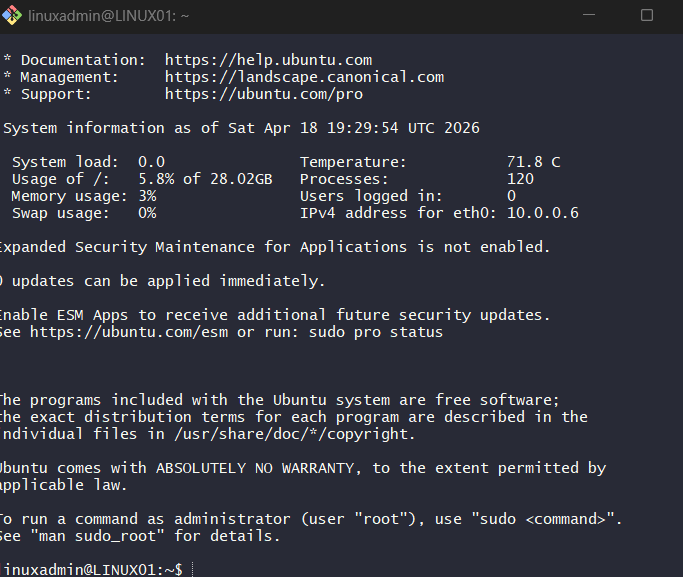

### 🟦 Step 2: Configure DNS - first attempt

Edited `/etc/systemd/resolved.conf` and set `DNS=10.0.0.4` and `Domains=corp.gmbh`, then restarted the service:

```bash
sudo nano /etc/systemd/resolved.conf
sudo systemctl restart systemd-resolved
resolvectl status
```

The first `resolvectl status` output showed the Global section still had no DNS configured and eth0 was showing Azure default DNS `168.63.129.16`. Edited the file again and restarted again. Second attempt showed Global DNS Servers `10.0.0.4` and DNS Domain `corp.gmbh` in the Global section, but eth0 was still showing `168.63.129.16`.

> This is Issue #10. Editing resolved.conf updates the Global DNS setting but Azure assigns DNS at the network interface level which overrides it. The eth0 interface was ignoring the global setting.

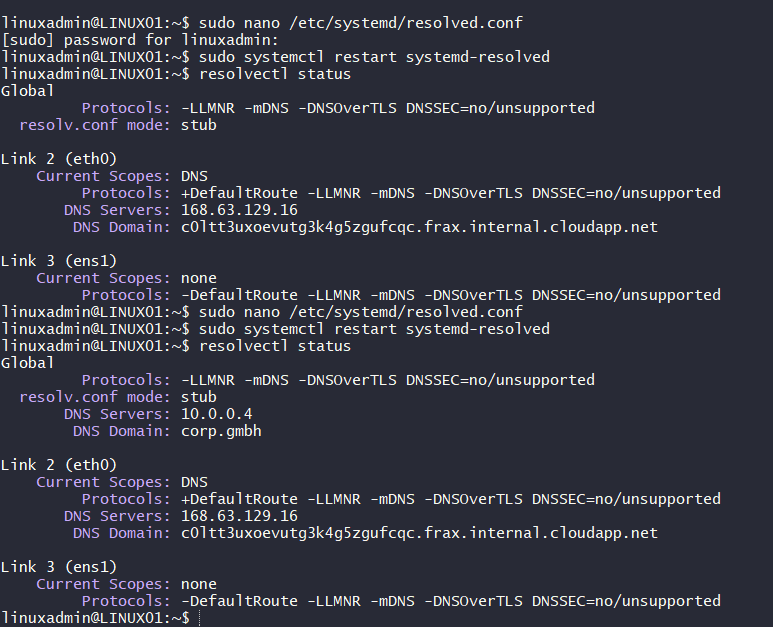

### 🟦 Step 3: Fix DNS at interface level

Applied the DNS override directly to the eth0 interface:

```bash
sudo resolvectl dns eth0 10.0.0.4
sudo resolvectl domain eth0 corp.gmbh
resolvectl status
```

This time `resolvectl status` showed the fix working at every level. Global section: `Current DNS Server: 10.0.0.4`, `DNS Servers: 10.0.0.4`, `DNS Domain: corp.gmbh`. Link 2 (eth0) section: `Current DNS Server: 10.0.0.4`, `DNS Servers: 10.0.0.4`, `DNS Domain: corp.gmbh`. Both Global and eth0 now pointing to DC01.

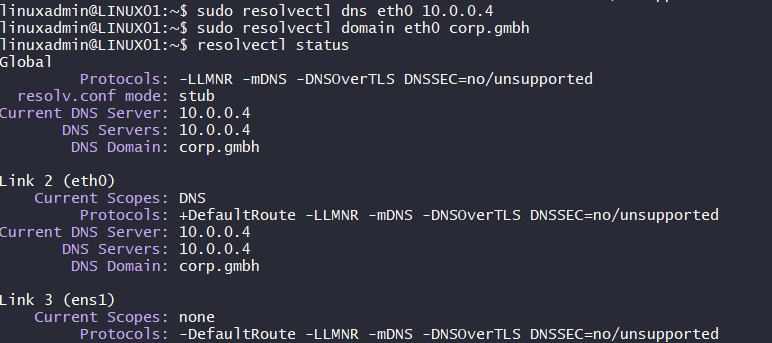

### 🟦 Step 4: Verify DNS resolution

```bash
nslookup corp.gmbh
```

Output: `Server: 127.0.0.53`, `Name: corp.gmbh`, `Address: 10.0.0.4`. The server showing as `127.0.0.53` is the local systemd-resolved stub resolver which is normal. The important result is `corp.gmbh` resolving to `10.0.0.4` confirming DC01 is reachable by name.

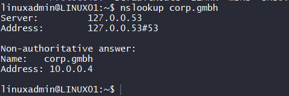

### 🟦 Step 5: Create and run join-ad-linux.sh

Created the three bash scripts directly on LINUX01 using nano, then made them executable and ran the domain join script:

```bash
nano /home/linuxadmin/join-ad-linux.sh
nano /home/linuxadmin/linux-user-audit.sh
nano /home/linuxadmin/setup-samba-share.sh
chmod +x /home/linuxadmin/join-ad-linux.sh
chmod +x /home/linuxadmin/linux-user-audit.sh
chmod +x /home/linuxadmin/setup-samba-share.sh
sudo /home/linuxadmin/join-ad-linux.sh
```

The script ran through all 6 steps. Step 1 synced the clock, confirmed `System clock synchronized: yes`. Step 2 configured DNS and confirmed `DNS OK`. Step 3 installed packages including realmd, sssd, sssd-tools, adcli, krb5-user, samba-common-bin and a long list of dependencies.

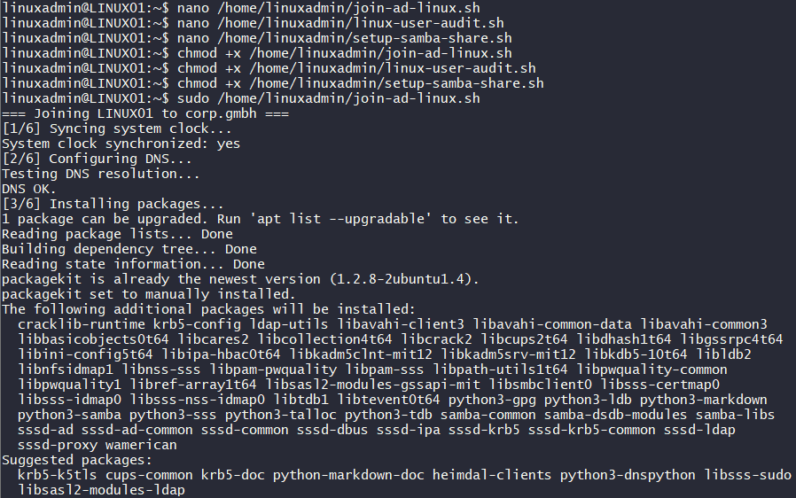

Step 4 discovered the domain and showed the full realm information: `corp.gmbh`, type kerberos, realm-name CORP.GMBH, server-software active-directory, client-software sssd. Step 5 joined the domain asking for the labadmin password. Step 6 configured SSSD and set up sudo rules for IT department groups. Final output: `=== Domain join complete ===`.

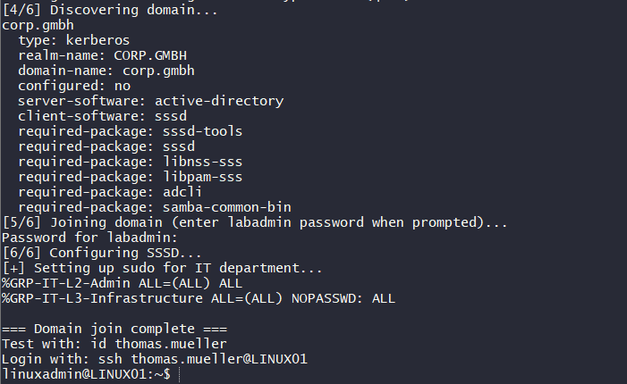

### 🟦 Step 6: Verify domain membership and test AD user

Ran `realm list` then immediately tested with `id thomas.mueller`:

```bash
realm list
id thomas.mueller
```

`realm list` showed corp.gmbh fully configured: type kerberos, realm-name CORP.GMBH, domain-name corp.gmbh, configured kerberos-member, server-software active-directory, client-software sssd, login-formats %U, login-policy allow-realm-logins.

`id thomas.mueller` returned his full AD identity: uid=626001133, gid=626000513 (domain users), and all his group memberships including grp-app-office365, grp-it-l3-infrastructure, grp-dept-it, grp-vpn-users, grp-projekt-iso27001, grp-fileshare-it. This confirms AD authentication is working on Linux and thomas.mueller's group memberships from the AD structure script are all visible.

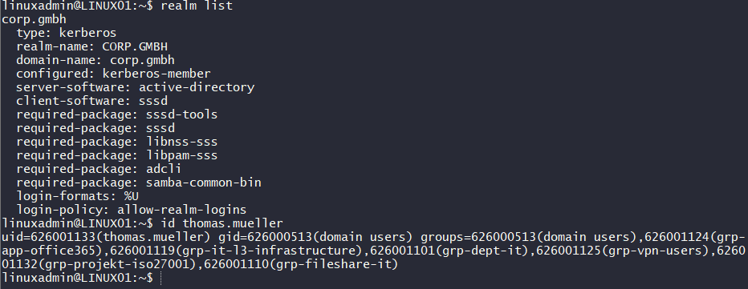

### 🟦 Step 7: Run user audit script

```bash
/home/linuxadmin/linux-user-audit.sh
```

Output showed local users with login shells: root (UID 0) and linuxadmin (UID 1000). AD users via SSSD section showed nobody at UID 65534. No custom sudoers files yet. No failed SSH logins in last 24 hours. Currently logged in: linuxadmin on pts/0 from 27.147.237.13.

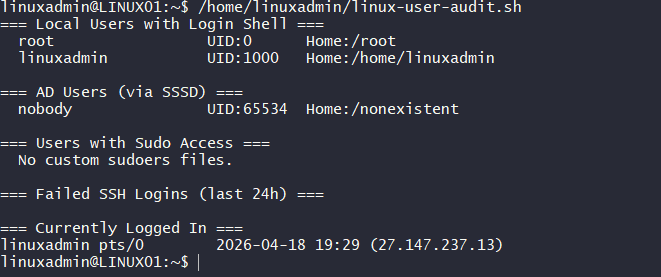

### 🟦 Step 8: Configure Samba shares

```bash
sudo /home/linuxadmin/setup-samba-share.sh
```

The script installed Samba and winbind, created share directories at `/srv/shares/allgemein` and `/srv/shares/entwicklung`, backed up the original smb.conf, wrote the new configuration with AD authentication (security = ADS, realm = CORP.GMBH, workgroup = CORP), and restarted smbd and nmbd.

The smb.conf written to disk showed both shares configured correctly: `[Allgemein]` at `/srv/shares/allgemein` with `valid users = @"CORP\GRP-FileShare-Allgemein"`, and `[Entwicklung]` at `/srv/shares/entwicklung` with `valid users = @"CORP\GRP-Dept-Entwicklung" @"CORP\GRP-Dept-IT"`. Final line: `Samba shares configured successfully`.

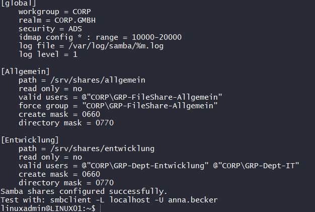

Module 4 was completed. LINUX01 is joined to corp.gmbh, AD users are authenticating via SSSD, thomas.mueller's group memberships are visible from Linux and Samba shares are configured with AD group-based access control. 
Resolves Issue #7.

---

## ☁️ Module 5: Helpdesk Ticket Simulations

### 🟦 Step 1: Restart VMs and reassign public IPs

Started DC01 and CLIENT01 from Azure portal after they were deallocated from the previous session. Reassigned public IPs to both VMs since Azure releases them on deallocation.


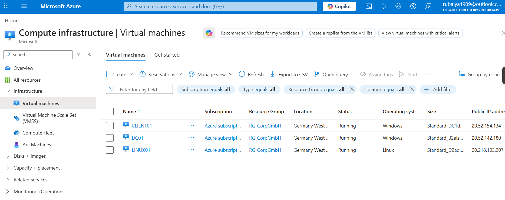

---

## 🟦 Issues resolved across all modules

| # | Title | Type | Module |
|---|---|---|---|
| 1 | Set up Azure infrastructure for three-VM lab environment | Enhancement | 1 |
| 2 | Install and configure Active Directory on DC01 | Enhancement | 2 |
| 3 | Join CLIENT01 to corp.gmbh domain | Enhancement | 3 |
| 4 | Integrate LINUX01 into Active Directory via realmd and SSSD | Enhancement | 4 |
| 5 | AD DS promotion fails via PowerShell due to special character encoding | Bug | 2 |
| 6 | CLIENT01 domain join fails with incorrect credentials error | Bug | 3 |
| 7 | LINUX01 DNS not applying from resolved.conf alone | Bug | 4 |
| 8 | Standard_B1s VM size not available in Germany West Central | Bug | 1 |

---

## ☁️ What is coming next

| Module | Status |
|---|---|
| Module 1: Infrastructure setup | Done |
| Module 2: Active Directory, DNS, DHCP | Done |
| Module 3: Join CLIENT01 to domain | Done |
| Module 4: Linux integration via realmd/SSSD and Samba | Done |
| Module 5: Helpdesk ticket simulations | Next session |
| Module 6: Group Policy configuration | Next session |
| Module 7: Security event monitoring | Next session |

---

<details>
  <summary> Earlier Option: Local Deployment (VirtualBox)</summary>
    Originally planned it, but I discontinued it due to host RAM constraints.

    ### Created the VMs
    Downloaded and installed VirtualBox from virtualbox.org. Created three VMs:

    - DC01: Windows Server 2025 Eval ISO
    - CLIENT01: Windows 11 Eval ISO
    - LINUX01: Ubuntu Server 22.04 ISO

    Note: It is better to install VirtualBox Extension Pack which can save time later and it is great for IT Home Labs which can provide capabilities, used by IT Professionals everyday.

    Set each VM to use an "Internal Network" adapter (name it "CorpNet"). DC01 also gets a NAT adapter for internet access during setup.
</details>

