# Enterprise Helpdesk and Active Directory Lab

A home lab environment simulating a small German company's IT infrastructure. I built this to get hands-on experience with Active Directory, Group Policy, and the kind of support tasks that come up every day in L1-L3 helpdesk work.

*Note on Infrastructure:* Originally designed for VirtualBox, this lab was migrated to **Microsoft Azure** to bypass local hardware RAM limitations (16GB) and ensure high performance for Windows 11 and Server 2025.

## ☁️ Why I built this
I have been helping family and friends with IT issues for years - password
resets, Wi-Fi troubleshooting, printer problems, setting up new laptops and system optimization for better speed and battery life etc. I also helped my German landlord set up their router, new mobile phone setup and fix mobile issues on multiple occasions. But none of that shows up on a CV.

So I decided to build the same kind of 'simulated' environment that a real company would have, document everything properly and show that I can help company and it's people with support work and administration related tasks systematically and not just 'I fixed my friend's laptop.'

## ☁️ What is in here

This lab simulates "CORP GmbH", which is a fictional German company with about 50 employees across five departments. The infrastructure includes:

- A Windows Server 2025 domain controller (named as - DC01) running AD DS, DNS and DHCP
- A Windows 11 workstation (named as - CLIENT01) joined to the domain
- An Ubuntu 22.04 server (named as - LINUX01) joined to AD via realmd/SSSD

## ☁️ Why is this lab Important?

Because I will be -

- Building multiple virtual machines
- Installing Windows and Linux
- Practising my Networking skills and permissions
- Creating an Active Directory environment
- Running snapshots and backups
- Experimenting freely
- Breaking things without breaking my real PC

Not to mention, I will also be able to test the lab by -

- Adding and managing users
- Resettings passwords
- Joining users or computers to a domain
- Troubleshooting network and DNS issues
- Simulating real help desk tickets

In short, I will have a mini DNS center in my PC!

## ☁️ How to set up this lab from scratch
*Update:* The infrastructure is now built inside an Azure Virtual Network (VNet) named CorpNet, consisting of:

### VMs

- DC01 (Windows Server 2025): The "Brain" of the company. Domain Controller, DNS, and DHCP.
- CLIENT01 (Windows 11): An employee workstation joined to the corp.gmbh domain.
- LINUX01 (Ubuntu 22.04): A Linux server integrated into the AD environment using realmd/SSSD.

## ☁️ Current Option: Cloud Deployment (Microsoft Azure)
To ensure the lab runs smoothly without slowing down my physical laptop, I used the following Azure resources:

- Virtual Network: 10.0.0.0/16 (Internal subnet for secure VM communication).

### VM Sizing:
- DC01: Standard_B2als_v2 - 2vcpus, 4GiB memory - Windows Server *2025* Datacenter: Azure Edition - x64 Gen2
- CLIENT01: Standard_DC1ds_v3 (1 vcpu, 8 GiB memory) - Windows 11 25H2 pro
- LINUX01: Standard_D2ads_v7 (2 vcpus, 8 GiB memory) - Ubuntu server 24.04 LTS

### Cost Management: 

Configured Auto-shutdown schedules to preserve Azure credits.

---

## ☁️ Module 1: Infrastructure Setup

### 🟦 Step 1: Virtual Network

Created `VNet-CorpNet` in resource group `RG-CorpGmbH`, Germany West Central. Address space `10.0.0.0/16` with one subnet `InternalSubnet` at `10.0.0.0/24`. All three VMs live on this subnet and communicate over private IPs only. Public internet access is restricted to RDP and SSH through Network Security Groups.

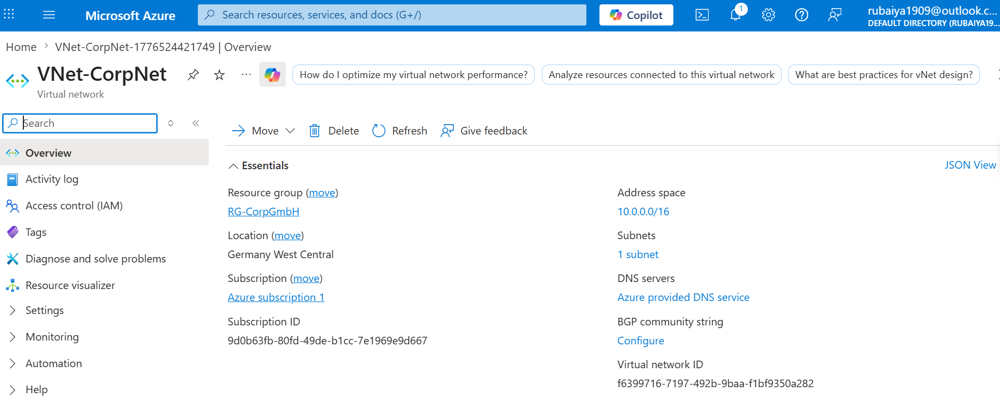

### 🟦 Step 2: DC01 - Domain Controller

Deployed DC01 as the first VM. This is the brain of the lab. Everything else depends on it.

| Setting | Value |
|---|---|
| Name | DC01 |
| OS | Windows Server 2025 Datacenter Azure Edition |
| Size | Standard_B2als_v2 (2 vCPU, 4 GiB RAM) |
| Private IP | 10.0.0.4 (static) |
| VNet | VNet-CorpNet / InternalSubnet |
| NSG | DC01-nsg |
| Location | Germany West Central |

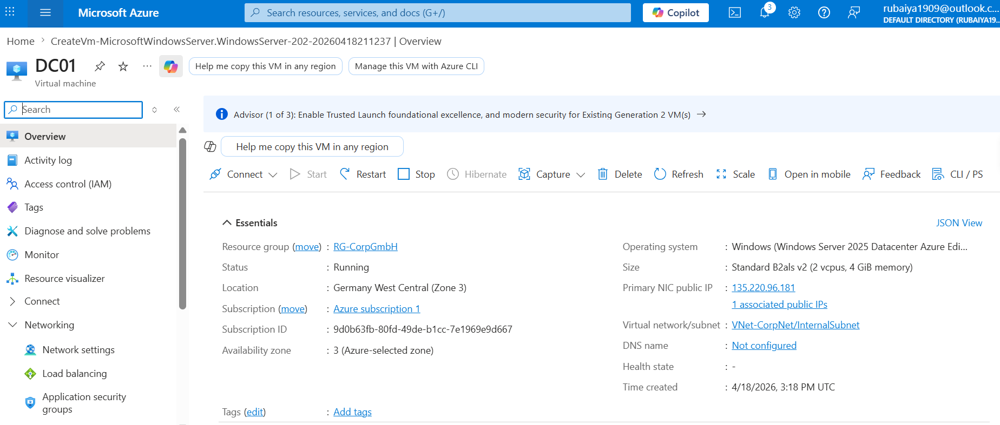

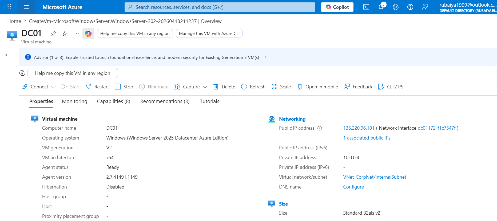

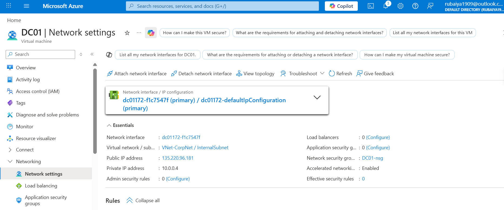

### 🟦 Step 3: CLIENT01 - Windows 11 Workstation

CLIENT01 simulates an employee's computer. It will join the corp.gmbh domain once DC01 is configured.

| Setting | Value |
|---|---|
| Name | CLIENT01 |
| OS | Windows 11 Pro 23H2 |
| Size | Standard_DC1ds_v3 (1 vCPU, 8 GiB RAM) |
| Private IP | 10.0.0.5 (static) |
| VNet | VNet-CorpNet / InternalSubnet |
| NSG | CLIENT01-nsg |
| Location | Germany West Central |

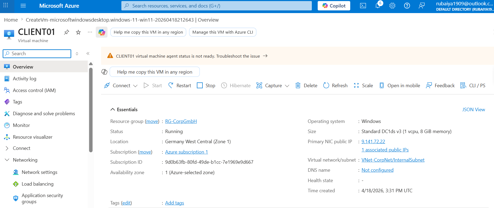

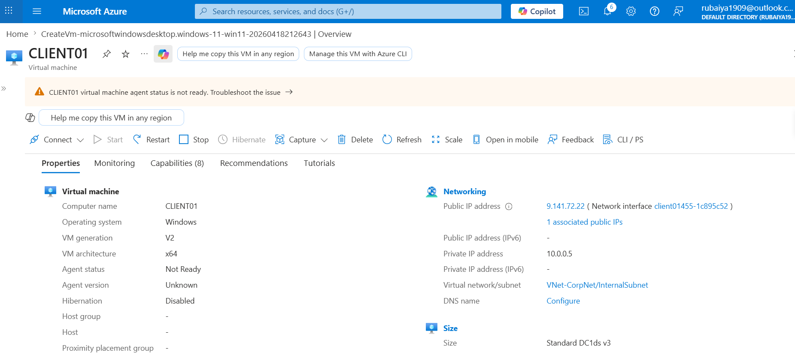

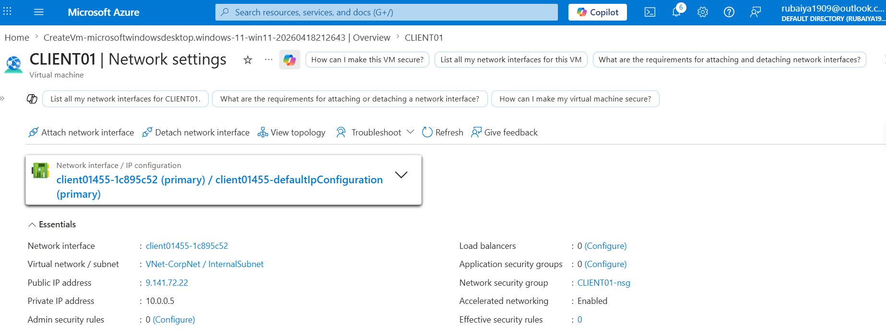

### 🟦 Step 4: LINUX01 - Ubuntu Server

LINUX01 is the Linux side of the lab. It will be integrated into Active Directory using realmd and SSSD.

| Setting | Value |
|---|---|
| Name | LINUX01 |
| OS | Ubuntu 24.04 LTS |
| Size | Standard_D2ads_v7 (2 vCPU, 8 GiB RAM) |
| Private IP | 10.0.0.6 (static) |
| VNet | VNet-CorpNet / InternalSubnet |
| NSG | LINUX01-nsg |
| Location | Germany West Central |

> Note: Standard_B1s was not available in Germany West Central. Used Standard_D2ads_v7 instead. See Issue #8.

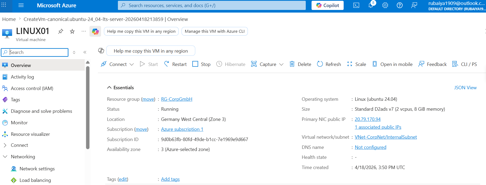

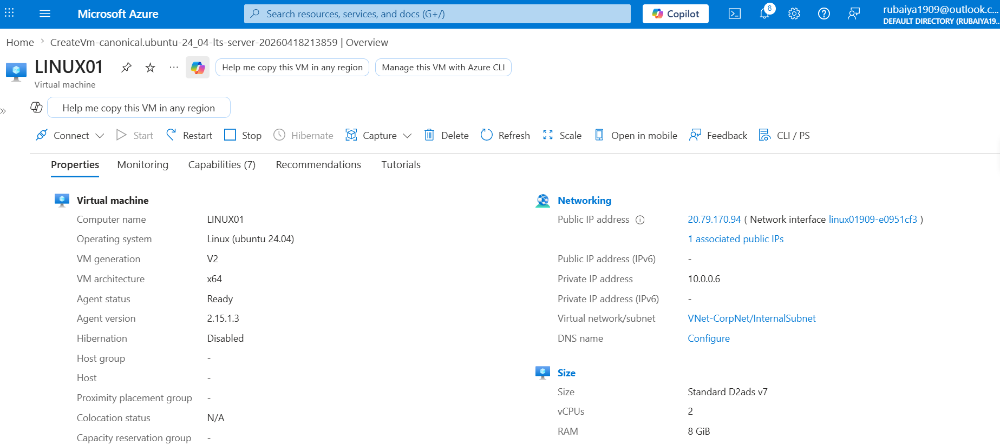


### 🟦 Step 5: All three VMs running

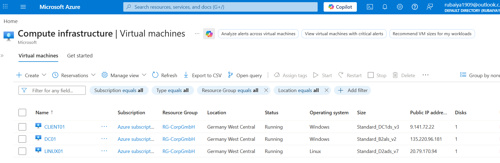

### 🟦 Step 6: RDP into DC01 and verify connectivity

RDP'd into DC01 using the downloaded RDP file. Server Manager opened confirming Windows Server 2025 is running.

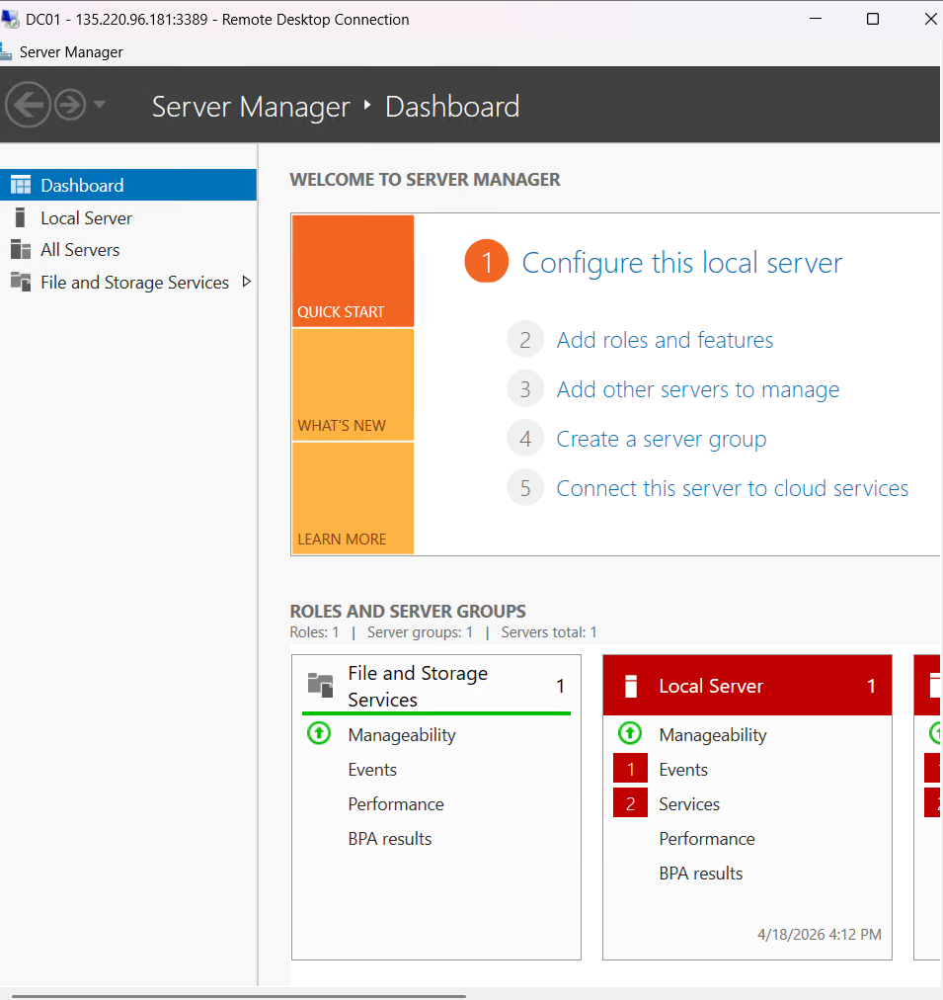

Then ran connectivity test from DC01 PowerShell to confirm all three VMs can reach each other over the internal subnet:

```powershell
Test-NetConnection -ComputerName 10.0.0.5 -Port 3389
Test-NetConnection -ComputerName 10.0.0.6 -Port 22
```

Azure blocks ICMP ping by default so TCP port test was used instead.

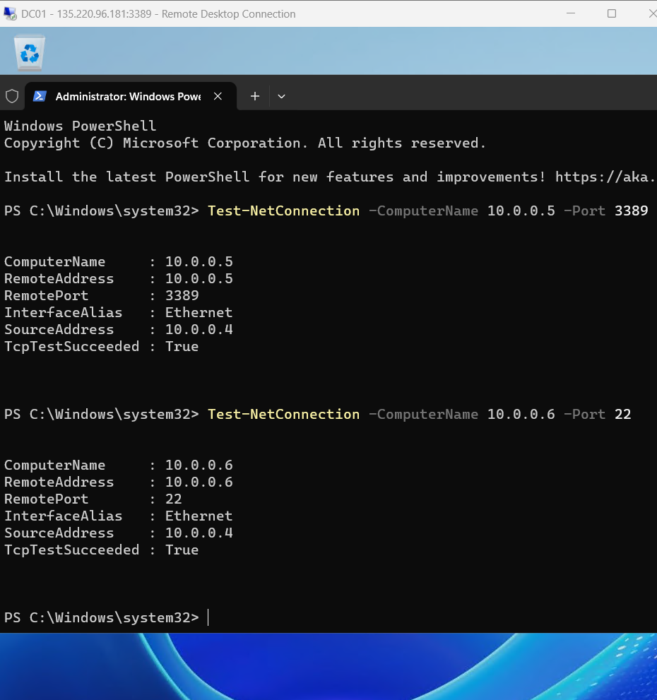

Both returned `TcpTestSucceeded: True`. All three VMs are on the same subnet and talking to each other. Module 1 complete.

### 🟦 Step 7: Deallocate after session

After taking all screenshots, all three VMs were deallocated to stop compute charges. Public IPs were deleted. New public IPs will be assigned at the start of each session.

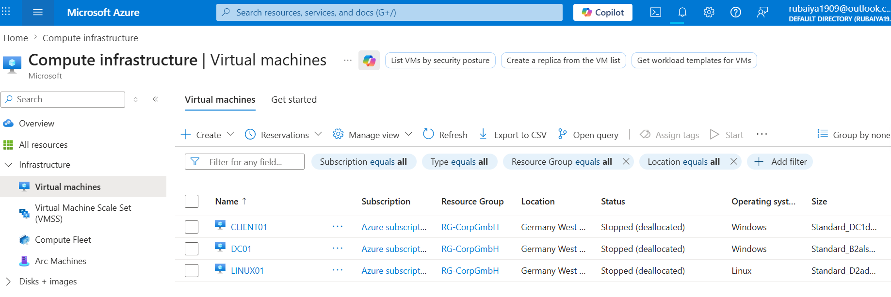

---

<details>
  <summary> Earlier Option: Local Deployment (VirtualBox)</summary>
    Originally planned it, but I discontinued it due to host RAM constraints.

    ### Created the VMs
    Downloaded and installed VirtualBox from virtualbox.org. Created three VMs:

    - DC01: Windows Server 2025 Eval ISO
    - CLIENT01: Windows 11 Eval ISO
    - LINUX01: Ubuntu Server 22.04 ISO

    Note: It is better to install VirtualBox Extension Pack which can save time later and it is great for IT Home Labs which can provide capabilities, used by IT Professionals everyday.

    Set each VM to use an "Internal Network" adapter (name it "CorpNet"). DC01 also gets a NAT adapter for internet access during setup.
</details>

